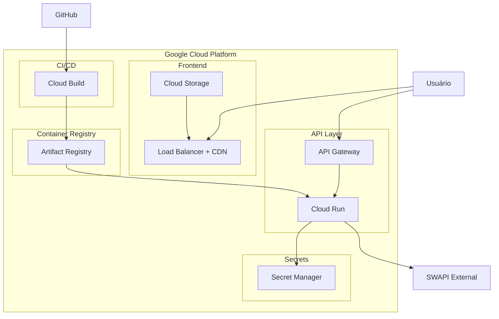

# Architecture

This document describes the architecture and technical decisions for the PowerOfData SWAPI Challenge.

## System Overview


## Request Flow


## Tech Stack

### Backend
- **FastAPI** - Chosen for async support, automatic OpenAPI docs, and excellent performance
- **httpx** - Async HTTP client, more modern than aiohttp for this use case
- **Pydantic v2** - Data validation and settings management
- **Python 3.11** - Latest stable with good async support

### Frontend
- **React 18** - Industry standard for SPAs
- **TypeScript** - Type safety and better DX
- **Vite** - Fast dev server and build tool
- **Tailwind CSS** - Utility-first, fast to develop
- **React Query** - Server state management with caching

### Infrastructure
- **Docker** - Containerization for consistent deployments
- **GCP Cloud Run** - Serverless containers, scales to zero

## Key Design Decisions

### Why FastAPI over Flask/Django?
1. Native async support - SWAPI calls can be slow, async prevents blocking
2. Automatic OpenAPI documentation - saves time, always up to date
3. Pydantic integration - validation happens automatically
4. Performance - one of the fastest Python frameworks

### Why httpx over requests/aiohttp?
- `requests` is synchronous, would block on SWAPI calls
- `aiohttp` works but httpx has a nicer API and is actively maintained
- httpx supports both sync and async with the same API

### Why Cloud Run over Cloud Functions?
- Cloud Functions has limitations with long-running requests
- FastAPI's ASGI server doesn't play well with Cloud Functions
- Cloud Run gives us a full container with no cold start penalties

### In-Memory Cache vs Redis
For this challenge, in-memory cache is simpler and sufficient for a single instance.
In production with multiple instances, we'd need Redis or similar.

The cache implementation uses a simple dict with TTL checks:
```python
cache = {
    "key": (value, timestamp)
}
```

### Rate Limiting Strategy
SWAPI has a 10k requests/day limit. Our rate limiter uses a token bucket algorithm:
- 5 requests per second by default
- Smooths out bursts
- Prevents hitting SWAPI limits

## API Endpoints

### Characters
| Method | Path | Description |
|--------|------|-------------|
| GET | /characters | List with pagination, search, sort |
| GET | /characters/{id} | Get by ID, optional homeworld |
| GET | /characters/{id}/films | Films featuring character |

### Planets
| Method | Path | Description |
|--------|------|-------------|
| GET | /planets | List with pagination, search, sort |
| GET | /planets/{id} | Get by ID |
| GET | /planets/{id}/residents | Characters from planet |
| GET | /planets/{id}/films | Films featuring planet |

### Starships
| Method | Path | Description |
|--------|------|-------------|
| GET | /starships | List with pagination, search, sort |
| GET | /starships/{id} | Get by ID |
| GET | /starships/{id}/pilots | Pilots of starship |
| GET | /starships/{id}/films | Films featuring starship |

### Films
| Method | Path | Description |
|--------|------|-------------|
| GET | /films | List with pagination, search, sort |
| GET | /films/{id} | Get by ID |
| GET | /films/{id}/characters | Characters in film |
| GET | /films/{id}/planets | Planets in film |
| GET | /films/{id}/starships | Starships in film |

### Utility
| Method | Path | Description |
|--------|------|-------------|
| GET | /health | Health check (no auth) |
| GET | /docs | OpenAPI documentation |

## Authentication

Simple API key authentication via `X-API-Key` header.

```
X-API-Key: your-api-key-here
```

The key is validated against the `API_KEY` environment variable.
For production, consider migrating to JWT or OAuth2.

## Error Handling

Custom exceptions for SWAPI-specific errors:
- `SwapiNotFoundError` - 404 from SWAPI
- `SwapiTimeoutError` - Request timeout after retries
- `SwapiRateLimitError` - SWAPI rate limit hit
- `InvalidApiKeyError` - Invalid/missing API key

All errors return consistent JSON:
```json
{
  "error": "SwapiNotFoundError",
  "message": "Character with id 999 not found",
  "path": "/characters/999"
}
```

## Deployment

### Local Development
```bash
# Backend
cd api
pip install -r requirements.txt
uvicorn src.main:app --reload

# Frontend
cd web
npm install
npm run dev
```

### Docker
```bash
# Build
docker build -t swapi-api ./api

# Run
docker run -p 8000:8000 -e API_KEY=your-key swapi-api
```

### GCP Cloud Run

Veja o guia completo em [GCP_DEPLOY_GUIDE.md](./GCP_DEPLOY_GUIDE.md).

**Arquitetura GCP:**



**Deploy rápido:**

```bash
# 1. Configurar variáveis
export GCP_PROJECT_ID=seu-projeto
export API_KEY=sua-chave-secreta

# 2. Executar script
./scripts/deploy-gcp.sh deploy
```

**Comandos manuais:**

```bash
# Build e push
gcloud builds submit --tag gcr.io/PROJECT_ID/swapi-api ./api

# Deploy
gcloud run deploy swapi-api \
  --image gcr.io/PROJECT_ID/swapi-api \
  --platform managed \
  --region us-central1 \
  --set-secrets="API_KEY=api-key:latest"
```

**Custos estimados (Free Tier):**
- Cloud Run: 2M requests/mês grátis
- Artifact Registry: 500MB grátis
- Secret Manager: 10k acessos/mês grátis
- **Total para projeto de teste: ~$0/mês**

## Future Improvements

- [ ] Redis cache for multi-instance deployments
- [ ] GraphQL endpoint for flexible queries
- [ ] WebSocket support for real-time updates
- [ ] API key management system
- [ ] Response compression
- [ ] Request logging to BigQuery
